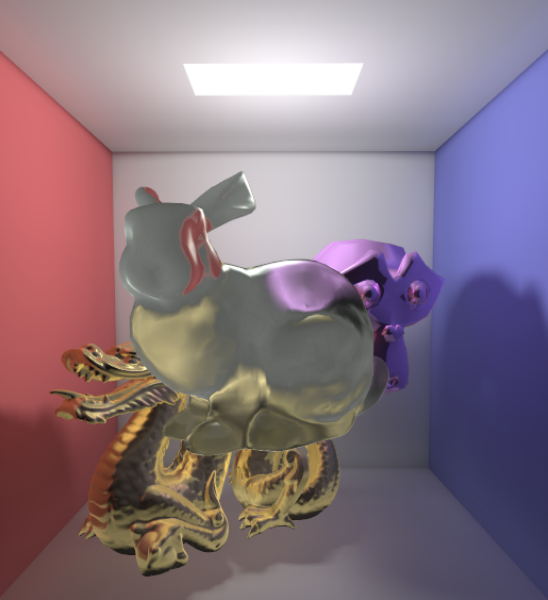

# 稀疏体素八叉树光追思路

已知与体素相关的有这样一些属性：pos、t、p、d、idx、scale

pos的范围是{0,1}，代表idx的二进制位，有三维，zyx，由低到高组成idx

p(t)=p+td    =》  

t代表一个类似时间的系数值，表示一种先后顺序，p代表射线原点，d代表一个方向向量

idx是体素的索引，由三个二进制位组成，zyx顺序作为它的位

scale是体素的缩放级别

* advance：推进到兄弟体素
* push：进入子体素
* pop：进入到某个祖先体素同级的体素

## idx的分布：


看不到到的那个角存放的索引是4

## 如何从一个体素到一个兄弟体素：

如图所示，这是一个xy轴的平面，光线投影到这个平面上时就得到了一条射线


带入$(x_0,y_0)$到t的计算公式中，就能解出射线与两条平行于坐标轴的直线相交位置的时间t，比如上图中计算出的与x轴相交的tmin代表与x0的相交的时间，如果在射线反向延长线上计算出的t，那么它为负

与两条轴线相交得到的两对tmin和tmax对应区域的交集就是射线与矩形相交的部分，所以要取所有计算出的tmin中最大的非负数作为开始进入到矩形区域的时间，tmax中最小的非负数作为射出矩形区域的时间，从而确保光线在所有轴线上都进入到或者射出了矩形区域

对于一个大的体素，它包含八个子体素，它的位置信息由pos$ (t_{x1},t_{y1},t_{z1})$表示，这是它的中心的坐标

取0号索引的子体素棱角的位置为$(t_{x0},t_{y0},t_{z0})$，7号索引的棱角为 $(t_{x2},t_{y2},t_{z2})$


要计算三维中的t值需要将光线与组成立方体的6个面求交，这通过将一对对角的坐标与光线求交实现，因为每个立方体的角都是三个面的交点，这两个角就能与六个面相交。可以将六个面划分为3对平行的面，每组对面都与某个轴线垂直，可以求出对应轴线的tmin与tmax，比如x轴垂直于yz面，那么这里求出的tmin与tmax就是x轴上求交得到的的时间，最后使用三个轴线最大的tmin和最小的tmax作为最终值，即光线进入立方体和离开立方体的时间

以上是对一个立方体，求得它的t的方法，在体素中需要对子体素进行求交，将tmax与三条轴线的tmax相比较，可以知道从哪条轴线垂直的面离开，比如tmax与x的tmax相等，那么光线就是延轴线x的方向从yz面离开的

## 如何得到下一个兄弟体素的idx：

知道了从哪个轴线垂直的面离开之后，就能够通过将对应轴线的idx的位翻转得到新的idx，idx的位顺序为zyx


从图上可以看出，如果光线进入到1中，并从xz面离开1，那么翻转idx的y轴的值，旧idx的二进制位是001，翻转y轴得到011，也就是3是新的idx

## 如何判断是否离开父体素：

按照idx的计算方式，离开一个体素时，会计算一个新的idx'，在本算法中光线的方向在某个轴线上如果为正，那么idx该轴线的位只能增加，如果在离开一个体素时，idx的一个或多个位的翻转方向与光线方向相反，那么就说明将要离开父体素，应该执行pop操作，反之advance，继续探索同级体素

另外也可以让idx翻转方向与光线方向相反这一判断，变成idx不发生变化了就说明光线离开父体素，这可以通过下面的代码实现

```glsl
idx=mix(idx, sign(rd), step(tmax_xzy,vec3(tmax_final)));
```

由于idx对应的是光线移动中碰到的体素的索引，通过几何观察可以发现只有在光线到达体素中心的三个平面时，idx的位发生翻转才是有意义的，而光线最多只可能与三个面分别相交一次，所以将idx设计成对应位只会翻转一次，那么当idx不变时就说明离开父体素了，需要进行pop操作，上面的代码就能做到这一点

# VXGI

体素锥体追踪使用三维纹理存储体素信息，它并没有应用稀疏体素八叉树SVO，是一种比较消耗显存的全局光照方案，常用的$512\times 512\times 512$大小的体素纹理存储RGBA的4字节光照信息，加上4字节法线信息，需要1GB的显存空间存储，抛开显存因素，它的体素追踪效率非常高，只需要知道点在标准纹理空间中的位置，就能插值得到体素信息

存储体素信息前需要将视口调整到体素的尺寸，以便每个屏幕片段能对应到所有该位置的体素，从而正确存储体素到规定尺寸的三维纹理当中。另外，由于不需要绘制到帧缓冲上，所以要禁用颜色通道，同时还需要保证同一屏幕片段对应的所有体素均被存储，不是被深度测试抛弃，要禁用深度测试，当然，面剔除也需要禁用，因为它也会舍弃片段，导致某些体素没有正确存储到纹理中

## 存储体素到三维纹理

要存储体素到三维纹理texture3d需要使用到顶点着色器、几何着色器、片段着色器，顶点着色器没有什么关键的地方，只是计算MVP变换，并且记录一个世界空间位置信息，几何着色器中的代码有一些关键的地方

```c
#version 450 core

layout(triangles) in;
layout(triangle_strip, max_vertices = 3) out;

in vec3 pos[];
in vec3 normal[];
in vec2 tex_coord[];

out vec3 Pos;
out vec3 Normal;
out vec2 Tex_coord;

//将三角形投影到使其面积最大的、轴组成的平面上
void main(void){
	const vec3 p1 = pos[1] - pos[0];
	const vec3 p2 = pos[2] - pos[0];
	const vec3 p = abs(cross(p1, p2)); 
	for(int i = 0; i < 3; i++){
		Pos = pos[i];
		Normal = normal[i];
		Tex_coord = tex_coord[i];
//		gl_Position = vec4(Pos,1);
		if(p.z >= p.x && p.z >= p.y){
			gl_Position = vec4(Pos.x, Pos.y, 0, 1);
		} else if (p.x >= p.y && p.x >= p.z){
			gl_Position = vec4(Pos.y, Pos.z, 0, 1);
		} else {
			gl_Position = vec4(Pos.x, Pos.z, 0, 1);
		}
		EmitVertex();
	}
    EndPrimitive();
}


```

此代码将输入到几何着色器中的图元，也就是三角形，投影到三个主轴面组成的三角形中，面积最大的那一个，转换到了xy面上，这是标准化坐标空间NDC的投影到视口的面


虽然三角形被转换到了xy面上，但这只是为了让片段着色器能处理到三角形最大的面积

三角形的顶点存储了一些属性，光栅化阶段需要从三角形顶点插值得到自己的属性。深度测试一般会在光栅化结束后，片段着色器开始前执行，由于深度测试会抛弃较深的片段，所以在执行这三个着色器时需要禁用深度测试，以保证片段不会被提前舍弃。由于禁用了深度测试，所有片段都会传入片段着色器中，尽管此时片段在xy平面，但它的属性中有一个原本片段的世界空间坐标信息，这是由它来自的三角形插值得到的，通过这个世界空间坐标，就相当于在转换前的轴面上向三角形填入体素，比喻一下，可以把xy平面的这个片段看作一个传送门，填入体素时，体素会传送到三角形片段所在的世界空间坐标下，具体操作是一些片段着色器的算法，现在不多做解释

下面是一个示意图，xy的三角形假设是有xz面的三角形得到，xy面三角形画圈的地方假设是一个片段，创建这个片段相关的体素，相当于从xz平面将该体素填入到三角形上


为什么需要最大的三角形投影呢，这是为了避免体素产生较大空隙，从而出现漏光、体素缺失的问题，具体可以参考这篇文章

[[译]体素技术介绍_体素法是什么-CSDN博客](https://blog.csdn.net/jxw167/article/details/85247237)

片段着色器中主要是转换片段的世界空间坐标范围到0~1的纹理空间中，并计算对应光照模型的光照信息，之后存储光照信息到计算出的体素位置即可

## 体素锥体追踪

体素椎体追踪实际上是在一个锥体面上向外延展查找沿途体素，比如可以在8个锥体面上的方向加一个法线方向上进行体素追踪，从片段对应的位置出发按一定的步长在这9个方向上查找体素，每找到一个体素就采样一次存储体素信息的三维纹理，累积一次光照结果，可以参考下面的示意图，法线方向就是锥体中心的方向


以上是间接光的漫反射追踪结果，间接光的高光的追踪只需要利用摄像机前向向量和法线计算出反射向量，以反射向量的方向为追踪方向查找体素即可

对于阴影来说，体素锥体追踪提供了很简单的实现方式，即在光源方向上追踪体素透明度信息乘以光线的衰减量，当积累得到的阴影信息小于0就表示完全黑暗的片段，终止追踪

对于自发光物体，由于会在着色模型中加入一个自发光颜色，所以自发光的影响其实写入了相应的体素中，其他物体使用漫反射锥体采样时就能获取来自自发光物体的颜色信息

透明物体的片段信息的追踪需要另外创建一个折射锥，下面是一篇论文中的展示，效果不是特别好



# 保守光栅化

英伟达显卡GTX4XX之后都支持一个扩展GL_NV_conservative_raster，它可以作为glEnable的参数，启用之后，片段只要与三角形相交，无论中心是否在三角形内，都会保留，所以保守光栅化一定程度上会降低性能，当提供了更高精度的片段信息

一篇介绍如何在几何着色器和片段着色器中启用保守光栅化的文章[第 42 章.保守栅格化 |NVIDIA 开发人员](https://developer.nvidia.com/gpugems/gpugems2/part-v-image-oriented-computing/chapter-42-conservative-rasterization)


# 构建稀疏体素八叉树

稀疏体素八叉树需要自顶向下地构建，从根体素出发，不断划分，寻找能进一步细分的子体素，并分配显存空间，下面是一些细节

## 1.构建体素列表

这个阶段需要像存储颜色信息到三维纹理中的那个VXGI的算法很像，区别在于此时不需要存入到一个三维纹理，而是存放信息到一个大小可能需要改变的缓冲区中，OpenGL Insight的文章中并没有提到如何构建体素列表，目前猜测是预估大小设置缓冲区，缓冲区大小不可能特别大，因为网格体只有表面片段会参与体素化，内部空间完全为空，保守估计分配完整体素空间所占空间的40%作为预估体素空间大小，不过512^3分辨率的体素空间所占空间，对于当前显卡来说不是什么大问题，毕竟每个体素占8字节空间，总体所占空间也不过1GB显存。因为需要构建稀疏体素八叉树，所以还需要预留一部分显存空间给新缓冲区，这个缓冲区大小可以通过使用OpenGL在着色器中的**原子计数器**（放在另一个缓冲区的数据）统计，片段着色器的数据是高度并行处理的，其中会使用很多GPU线程，使用原子计数器也能很好地避免越界

此处获取原子计数器的值有**同步问题**，需要等待着色器处理完所有片段

## 2.自顶向下遍历八叉树

假设一开始有一个处理片段获得的**体素列表**，其中某个体素包含一个位置信息pos(a,b,c)，假设体素分辨率为512^3，要确定根体素的哪个子节点需要细分，要计算根体素的边界信息，根体素的边界为(1,1,1)，由此可得中心的坐标为(0.5,0.5,0.5)，这是过中心的三个平面（平行于主轴面的平面）的交点，判断pos的每一个坐标与0.5的大小关系就能得到pos处于哪个区域，八个子节点的区域由过中心的三个平面划分，得到需要划分的区域后，继续计算它的中心点，然后判断pos处于它的八个区域中的哪一个，如此往复，直到达到最大的划分深度，就算是到达了八叉树的叶子节点

以上是对八叉树一次遍历的描述，现在讲解总的流程。自顶向下遍历八叉树需要三个步骤：①标记获取需要划分的子节点；②每次划分子节点时，分配8个子节点区域；③初始化新节点；
