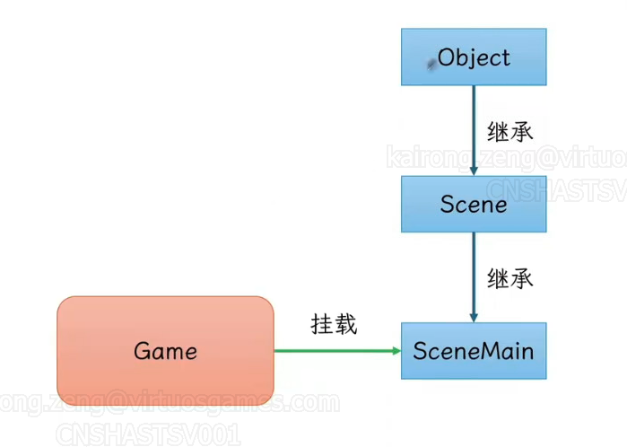
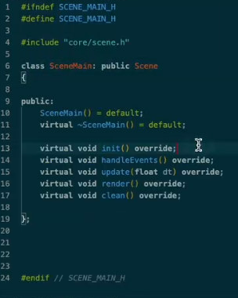

# 游戏框架设计

模块化：每个类功能独立，较少依赖

使用继承+组件

自动挂载和清理，自动挂载通过基础相同父类，放入相同容器管理实现


## Game

Game是一个单例模式的类，其中有Scene类对象负责管理渲染列表

## Actor

Actor对象的渲染会依赖于Scene类对象，每当一个需要渲染的Actor对象创建后，要使用Game对象的注册函数，添加Actor的渲染信息到Scene对象中，以便之后执行统一渲染

Actor对象有一个Component类的指针列表，在这个列表中可以挂载Mesh、Physics以及一些自定义组件

## Scene



### Object结构

所有类都需要基础Object，其中包含一些虚函数，需要使用时这些虚函数时，基础Object的类自行实现即可


Object类中放入了game的一个引用，这简化了调用，不需要在需要使用game的时候再去添加头文件，之后才能使用

### Scene结构

这里的摄像机改成摄像机类的指针


## SceneMain结构

SceneMain对象将挂载到Game对象上，用一个vector管理需要绘制的物品，需要绘制的物品都继承自obeject，所以都拥有绘制相关接口，在SceneMain对象中可以调用这些物品的render函数来绘制它们自身



## Component

### ue中的UPrimitiveComponent


UPrimitiveComponent是Unreal Engine中所有可渲染对象组件的基类。它提供了基本的功能和属性，使得子类可以在场景中呈现视觉效果。以下是对UPrimitiveComponent及其一些重要子类的介绍：

UPRIMITIVECOMPONENT

UPrimitiveComponent是一个抽象基类，不能直接实例化。它提供了以下功能：

* 渲染属性： 包括可见性设置、材质、阴影属性等。
* 碰撞属性： 支持基本的碰撞检测和响应。
* 物理属性： 提供简单的物理模拟支持。
* 渲染代理： 用于在渲染线程上表示组件。

主要子类

1. UStaticMeshComponent

   * 用于渲染静态网格（Static Mesh）。这是最常用的组件之一，适合渲染静态几何体，如建筑、家具等。
   * 支持高级渲染功能，如光照贴图、LOD（Level of Detail）等。
2. USkeletalMeshComponent

   * 用于渲染骨骼网格（Skeletal Mesh），特别适合动态角色和动画。
   * 支持骨骼动画、蒙皮、物理模拟等。
3. UInstancedStaticMeshComponent

   * 用于高效渲染多个相同的静态网格实例。
   * 适合渲染大量重复物体，如森林中的树木、草地等。
4. UHierarchicalInstancedStaticMeshComponent

   * 类似于UInstancedStaticMeshComponent，但支持层次化的LOD和剔除，进一步优化性能。
   * 常用于大型场景中的植被或其他重复对象。
5. UParticleSystemComponent

   * 用于渲染复杂的粒子系统。
   * 支持各种粒子效果，如烟雾、火焰、爆炸等。
6. ULightComponent

   * 用于在场景中添加光源。
   * 有多个子类，如UPointLightComponent、UDirectionalLightComponent、USpotLightComponent等，每种光源类型都有不同的特性和用途。
7. UShapeComponent

   * 提供基本的几何形状（如盒子、球、胶囊）用于简单的碰撞和物理模拟。
   * 包括UBoxComponent、USphereComponent、UCapsuleComponent等。

使用场景

* UPrimitiveComponent及其子类是Unreal Engine中所有可视化和交互对象的基础。通过这些组件，你可以在场景中实现丰富的视觉效果和交互功能。
* 在游戏开发中，理解和正确使用这些组件可以帮助你高效创建复杂的场景和角色。

通过这些子类，Unreal Engine提供了广泛而灵活的工具来满足不同的渲染和交互需求。根据具体的游戏需求，你可以选择合适的组件来实现你的设计目标。

## 双人模式设计思路

要实现一个主窗口包含两个子窗口的布局，并且让整个画面看起来像一个完整的整体，你可以对窗口样式进行一些调整，确保子窗口没有边框或标题栏。以下是你可以采取的步骤和修改：

创建子窗口的调整

1. 无边框的子窗口：

   * 使用 WS_CHILD 和 WS_VISIBLE 样式创建子窗口，同时确保不添加边框或标题栏样式，这样子窗口将会无缝地嵌入到主窗口中。
2. 处理关闭功能：

   * 关闭功能通常是由主窗口处理的，因为子窗口是依附于主窗口存在的。当关闭主窗口时，所有子窗口也会自动关闭。

修改后的示例代码

```C++
#include <windows.h>

LRESULT CALLBACK WindowProc(HWND hwnd, UINT uMsg, WPARAM wParam, LPARAM lParam) {
    switch (uMsg) {
        case WM_DESTROY:
            PostQuitMessage(0);
            return 0;
        case WM_PAINT:
            // 在这里添加渲染代码
            break;
    }
    return DefWindowProc(hwnd, uMsg, wParam, lParam);
}

int WINAPI WinMain(HINSTANCE hInstance, HINSTANCE, LPSTR, int nShowCmd) {
    const char CLASS_NAME[] = "MainWinClass";

    WNDCLASS wc = {};
    wc.lpfnWndProc = WindowProc;
    wc.hInstance = hInstance;
    wc.lpszClassName = CLASS_NAME;

    RegisterClass(&wc);

    HWND hwndMain = CreateWindowEx(
        0, CLASS_NAME, "Main Window", WS_OVERLAPPEDWINDOW,
        CW_USEDEFAULT, CW_USEDEFAULT, 800, 600,
        NULL, NULL, hInstance, NULL
    );

    if (hwndMain == NULL) {
        return 0;
    }

    ShowWindow(hwndMain, nShowCmd);

    // 创建左子窗口
    HWND hwndLeft = CreateWindowEx(
        0, CLASS_NAME, NULL, WS_CHILD | WS_VISIBLE,
        0, 0, 400, 600, hwndMain, NULL, hInstance, NULL
    );

    // 创建右子窗口
    HWND hwndRight = CreateWindowEx(
        0, CLASS_NAME, NULL, WS_CHILD | WS_VISIBLE,
        400, 0, 400, 600, hwndMain, NULL, hInstance, NULL
    );

    MSG msg;
    while (GetMessage(&msg, NULL, 0, 0)) {
        TranslateMessage(&msg);
        DispatchMessage(&msg);
    }

    return 0;
}
```

详细说明

* 窗口样式：

  * 子窗口使用 WS_CHILD 和 WS_VISIBLE 样式，确保它们是完全嵌入式的，没有边框和标题栏。
* 关闭功能：

  * 主窗口的关闭会自动关闭所有子窗口，因为子窗口是主窗口的一部分。
* 一致的视觉效果：

  * 通过这种设置，整个窗口看起来像一个整体。你可以在子窗口中渲染不同的内容，但它们在视觉上会被主窗口的布局控制。

这种设计适合用于需要在同一窗口中显示多个视图的应用程序，例如双人游戏，确保用户体验的一致性。你可以进一步调整窗口尺寸和布局，以适应特定的设计需求。

## 视锥体剔除

视锥体剔除是在光栅化之前的一个步骤完成的。它是属于几何阶段的一部分，目的是减少需要提交给GPU的几何数量，从而提高渲染性能。以下是视锥体剔除在渲染流水线中的位置和作用：

渲染流水线概述

1. 应用层（Application Layer）：

   * 在这一阶段，游戏逻辑和物理模拟被更新，确定场景中所有对象的位置和状态。
   * 视锥体剔除是应用层的一部分，因为它涉及摄像机和对象位置的计算。
2. 几何处理（Geometry Processing）：

   * 视锥体剔除（Frustum Culling）：
     * 在这一阶段，场景中的每个对象都会检测其边界盒（Bounding Box）或边界球（Bounding Sphere）是否在摄像机的视锥体内。
     * 只有那些与视锥体相交的对象会被标记为可见，并继续进入后续的渲染处理阶段。
3. 渲染准备：

   * 在视锥体剔除之后，其他剔除技术（如遮挡剔除）可能会进一步减少需要渲染的对象。
   * 接下来，场景的可见对象会被提交到渲染队列，准备进行光栅化。
4. 光栅化（Rasterization）：

   * 在光栅化阶段，GPU将可见几何体转换为屏幕上的像素。
   * 视锥体剔除的目的就是尽可能减少进入这一阶段的几何体数量，以提高渲染效率。

为什么视锥体剔除在光栅化之前？

* 性能优化： 视锥体剔除在CPU或GPU的几何阶段进行，目的是减少传递到GPU光栅化阶段的几何数量。这样做可以显著提高性能，因为光栅化是一个计算密集的过程。
* 资源管理： 减少不必要的顶点处理和像素着色，能够减少内存带宽使用和计算资源消耗。
* 早期剔除： 在几何阶段剔除不可见对象，比在光栅化阶段剔除更加高效，因为后者已经开始进行像素级别的处理。

通过在光栅化之前进行视锥体剔除，渲染引擎能够更高效地利用计算资源，确保只有必要的对象被提交给GPU进行渲染。
