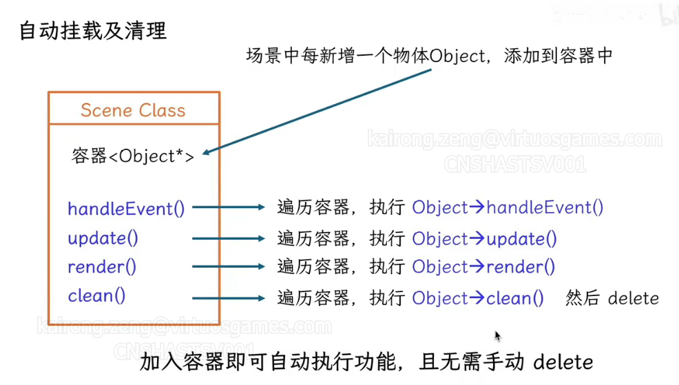

# 游戏框架设计

模块化：每个类功能独立，较少依赖

使用继承+组件

自动挂载和清理，自动挂载通过基础相同父类，放入相同容器管理实现




## 主体结构


## 游戏运行流程

```c++
int main()
{
	Game::getInstance().init();
	while()
	{
		game.eventHandle();
		game.update();
		render(game.getMeshComponentList());
	}
}
```

## Object

所有类都需要基础Object，其中包含一些虚函数，需要使用时这些虚函数时，基础Object的类自行实现即可，继承自object的对象都不能在game的构造内构造，因为object要获取game的引用，但game如果此时还没构造完，会产生未定义行为

```c++
class Object
{
public:
	Object() = default;
	virtual ~Object() = default;
	virtual void init(){}
	virtual void handleEvents(){}
	virtual void update(float deltaTime){}
protected:
	Game& game = Game::GetInstance();
};
```


Object类中放入了game的一个引用，这简化了调用

**以下是ai的分析：**

在父类中存放子类对象的引用是一种常见的设计模式，尤其是在使用多态性和面向对象编程时。然而，这种设计需要注意一些潜在的风险和考虑事项：

风险

1. 对象生命周期管理：

   * 确保子类对象的生命周期长于或至少与其在父类中存放的引用相同。否则，可能会导致悬空指针（dangling pointer）问题。
2. 对象切片（Slicing）：

   * 如果父类存放的是对象而不是指针或引用，可能会导致对象切片问题，即子类的特定数据和行为丢失。因此，通常建议使用指针或引用来存放子类对象。
3. 类型安全：

   * 在父类中处理子类对象时，确保类型转换是安全的。如果需要向下转换（downcast），务必使用安全的转换机制，如dynamic_cast（在C++中），以防止类型转换错误。
4. 内存管理：

   * 如果父类直接管理子类对象的内存（如通过指针），要小心内存泄漏和重复删除（double delete）的问题。使用智能指针（如std::shared_ptr或std::unique_ptr）可以帮助管理内存。

好处

1. 多态性：

   * 存放子类对象的引用在父类中可以利用多态性，允许通过父类接口调用子类的实现。这种设计增加了系统的灵活性和可扩展性。
2. 代码复用：

   * 通过父类接口可以实现代码复用，减少重复代码，更容易对系统进行维护和扩展。
3. 抽象和封装：

   * 父类可以定义一组抽象接口，而具体实现由子类提供。这种设计提高了代码的封装性和模块化程度。

建议

* 使用智能指针：考虑使用智能指针来管理子类对象的生命周期，减少手动内存管理的复杂度。
* 确保类型安全：在需要向下转换时，确保使用安全的转换方法。
* 清晰的接口设计：确保父类接口清晰明了，子类实现与父类接口保持一致。

如果你有更具体的场景或代码示例，我们可以更详细地探讨其设计和实现。

## Game

Game是一个单例模式的类，Game更新要调用actor的update接口，Game绘制需要到Scene中将可渲染列表中的MeshComponent按流水线状态渲染

```c++
class Game: public Object
{
public:
	static Game& getInstance()
	{
		static Game game;
		return game;
	}
	void init();
	void run();
	void handleEvents();
	void update();
	void render();
	void loadLevel(const char* levelPath);
private:
	unsigned int screenWidth = 1280;
	unsigned int screenHeith = 720;
	bool bisRunning = true;
	RenderInterface* rd;
	RenderResource* res;
	AudioInterface* ad;
	Level* currentLevel;
	Scene* scene;
	Physics* Physics;
	Game();
	Game(const Game&) = delete;
	Game& operator=(const Game&) = delete;
	~Game();
};
```

## ！！GameMode

管理游戏规则，其中需要注册失败和胜利事件，在玩家达成胜利条件或失败时触发这两个事件，执行相关逻辑

## AssetManager

管理关卡的资源加载，设置触发某个事件时，关卡加载的相关初始化函数，里面设置一个当前关卡指针，game从AssetManager中获取当前关卡的actor列表

考虑使用xml、json存储信息，存储时使用一个个对象存储

### ！！动态加载资源

## Level

Level中需要管理关卡信息，加载关卡时需要向Scene注册可渲染对象、光照信息，光照信息作为actor存储，加载时调用actor各自的初始化，以自动加载各自的信息，比如光照只需要注册到Scene中，可渲染对象如果启用物理，就需要同时注册到Scene和Physics中

```C++
class Level: public Object
{
public:

private:
	vector<Actor*> actors;
};
```

## Actor

Actor提供了对根组件的管理接口，方便其子类使用组合，Actor提供了更新根组件同步更新子组件的方法，所以在子类对象中调用更新时需要调用一次Actor的更新，它对子类隐藏了根组件及其子组件的更新过程

Actor对象的渲染会依赖于Scene类对象，每当一个需要渲染的Actor对象创建后，要使用Game对象的注册函数，添加Actor的渲染信息到Scene对象中，以便之后执行统一渲染

Actor对象有一个根组件，它的类型是SceneComponent*，可挂载Mesh、物理相关组件以及一些自定义组件，以实现统一管理效果

```c++
class Actor: public Object
{
public:
	//使用根组件的getIsUpdate查询根组件是否更新
	void updateComponent();//更新组件及其子组件信息，这一方法对Actor的派生类隐藏，子类不需要对其进行实现，Game主循环的update之后调用这一函数
private:
	SceneComponent* rootComponent;
	Actor* Owner;//用于设置Actor的附属关系，伤害来源的获取时会用到
};
```

### 困难

组件可能需要获取Actor，同时需要知道父类的类型

解决方案：在Actor::addcomponent中向组件传入Actor*，Actor的类型通过type判断。假如组件需要获取Actor某个派生类的方法，就通过组件获取到的指针，得到其中的类型字段

## 已废弃 Scene

需要管理渲染对象、光照信息，后期可以考虑实现初始化时合并相同材质网格体，目前暂时直接每次

### Scene结构

```c++
class Scene: public Object
{
public:
	void draw();//按流水线状态PSO进行渲染，进阶优化：考虑使用多线程创建不同PSO命令列表，之后在主线程合并命令列表
private:
	CameraComponent* camera;//主摄像机
	vector<ComPtr<ID3D12PipelineState>> PSOs;//流水线状态列表
	unordered_map<ComPtr<ID3D12PipelineState>, vector<MeshComponent*>> mapShaderToMesh;//流水线状态对象到mesh列表的映射
};
```

利用哈希表和向量来减少着色器上下文切换，因为减少管线状态对象（PSO）的切换可以显著提高渲染效率。可能进一步提升性能的方法：

1. 使用指针作为键：

   * 在使用unordered_map时，使用智能指针（如ComPtr）作为键可能会有一些性能开销，因为哈希计算可能更复杂。考虑使用裸指针（例如ID3D12PipelineState*）作为键，前提是你能确保正确管理对象的生命周期。
2. 预排序网格：

   * 在构建unordered_map时，可以考虑预先对每个vector<MeshComponent*>进行排序，以便在渲染时减少其他开销。
3. 批处理渲染：

   * 在渲染时，尽量批量提交命令列表，而不是逐个提交。你可以在一次命令列表提交中处理多个PSO的渲染，以减少GPU的同步和提交开销。
4. 减少内存分配：

   * 在初始化unordered_map和vector时，尽量使用reserve来预分配内存空间，以减少运行时的动态内存分配。
5. **多线程命令列表录制**：

   * DirectX 12支持多线程录制命令列表。你可以在多个线程中并行录制不同的PSO的渲染命令，然后在主线程中提交它们。
6. Pipeline State Object的创建：

   * 确保PSO是静态创建的，在初始化阶段预先创建好所有需要的PSO，避免在渲染循环中频繁创建。

这里的摄像机改成摄像机类的指针


## 急 Material

材质需要管理着色器需要的纹理等信息，由于不同着色器需要不同的信息，所以需要保存一个流水线状态对象指针

```c++
class Material
{
public:

private:
	vector<Texture*> textures;
};
```

在RenderResource中有一个ConstantBuffer结构体，里面存放需要上传到着色器的常量缓冲区数据，其中有个叫UploadConstantBuffer的函数用于将ConstantBuffer结构体中的数据传入到GPU，material可以定义数据到ConstantBuffer中，利用这个接口来传输着色器需要的数据

通过对框架的调试，可以确定RenderInterface管理整个游戏循环的渲染，一个RenderResource对象对应一组模型数据

## Texture

Texture需要管理Material中的纹理资源

## Component

### ue中的UPrimitiveComponent


UPrimitiveComponent是Unreal Engine中所有可渲染对象组件的基类。它提供了基本的功能和属性，使得子类可以在场景中呈现视觉效果。以下是对UPrimitiveComponent及其一些重要子类的介绍：

UPRIMITIVECOMPONENT

UPrimitiveComponent是一个抽象基类，不能直接实例化。它提供了以下功能：

* 渲染属性： 包括可见性设置、材质、阴影属性等。
* 碰撞属性： 支持基本的碰撞检测和响应。
* 物理属性： 提供简单的物理模拟支持。
* 渲染代理： 用于在渲染线程上表示组件。

主要子类

1. UStaticMeshComponent

   * 用于渲染静态网格（Static Mesh）。这是最常用的组件之一，适合渲染静态几何体，如建筑、家具等。
   * 支持高级渲染功能，如光照贴图、LOD（Level of Detail）等。
2. USkeletalMeshComponent

   * 用于渲染骨骼网格（Skeletal Mesh），特别适合动态角色和动画。
   * 支持骨骼动画、蒙皮、物理模拟等。
3. UInstancedStaticMeshComponent

   * 用于高效渲染多个相同的静态网格实例。
   * 适合渲染大量重复物体，如森林中的树木、草地等。
4. UHierarchicalInstancedStaticMeshComponent

   * 类似于UInstancedStaticMeshComponent，但支持层次化的LOD和剔除，进一步优化性能。
   * 常用于大型场景中的植被或其他重复对象。
5. UParticleSystemComponent

   * 用于渲染复杂的粒子系统。
   * 支持各种粒子效果，如烟雾、火焰、爆炸等。
6. ULightComponent

   * 用于在场景中添加光源。
   * 有多个子类，如UPointLightComponent、UDirectionalLightComponent、USpotLightComponent等，每种光源类型都有不同的特性和用途。
7. UShapeComponent

   * 提供基本的几何形状（如盒子、球、胶囊）用于简单的碰撞和物理模拟。
   * 包括UBoxComponent、USphereComponent、UCapsuleComponent等。

使用场景

* UPrimitiveComponent及其子类是Unreal Engine中所有可视化和交互对象的基础。通过这些组件，你可以在场景中实现丰富的视觉效果和交互功能。
* 在游戏开发中，理解和正确使用这些组件可以帮助你高效创建复杂的场景和角色。

通过这些子类，Unreal Engine提供了广泛而灵活的工具来满足不同的渲染和交互需求。根据具体的游戏需求，你可以选择合适的组件来实现你的设计目标。

### ActorComponent结构

提供注册接口，管理是否每帧更新，没有位置之类的信息，像生命值组件这样的组件就可以使用ActorComponent

### SceneComponent结构

提供位移、缩放和旋转等功能，并可管理是否启用组件

```c++
class SceneComponent: public Object
{
public:
	//各变换参数信息的get方法的实现
	//...

	//设置全局变换和局部变化参数时，都需要标记子组件需要更新
	//设置全局变换，全局变换改变时需要同步修改局部变换，以保持一致性
	void setTransform(vec3 transformVec);
	void setScale(vec3 scaleVec);
	void setRotate(vec3 rotation);
	//设置局部空间变换，局部变换后要影响自身的全局变换
	void setLocalTransform(vec3 transformVec);
	void setLocalScale(vec3 scaleVec);
	void setLocalRotate(vec3 rotation);

	void updateComponent();//更新子组件全局变换信息，这里需要利用自己的全局变换，并获取子组件的局部变换，计算出子组件的全局变换信息
	bool getIsUpdated(){return bisUpdated;}//主要提供给actor查询根组件是否被更新
protected:
	bool bisWorking = true;
	bool bisUpdated = false;//当前组件是否被更新，目前主要用于actor中查询根节点是否被更新
	bool bcanDraw = false;
	//根组件的位置等信息本地与全局意义相同，都表示全局，对于子组件而言此变换需要通过父组件的全局变换和自己的局部变换效果综合得到
	vec3 position;
	vec3 scale;
	vec3 rotation;
	qua quaRotation;
	//局部空间
	vec3 localPosition;
	vec3 localScale;
	vec3 localRotation;
	qua loacalQuaRotation;

	vector<SceneComponent*> component;//所挂载的组件
	SceneComponent* preComponent;//父组件指针
};

```

挂载组件流程


#### 困难

1. 当组件为多级的树状结构时，如何直接对被标记为需要更新的组件的子组件进行更新。这种情况的使用情景是应用物理到多级树状结构的组件树时，只有子组件的全局变换发生了变化，为了减少不必要的遍历，需要高效地找到需要更新的组件。目前虽然没有多级结构（坦克的子组件可以都与根组件直接连接），但为了扩展，可能需要考虑这个问题

### MeshComponent结构

管理网格体和碰撞体，提供渲染接口，MeshComponet可以作为根组件，但因为根组件的指针类型是SceneComponent，所以实际使用MeshComponent的方法时需要进行类型转换

```c++
class MeshComponent: public SceneComponent
{
public:
	void draw();
private:
	vector<vec3> vertices;//存放顶点的位置信息
	RenderResource* res;
	ShapeComponent* shapeComponent;//提供碰撞体信息
};
```

顶点位置信息通过RenderMeshResource中的LoadVertexPositionCallBack可以获取，可以在这个回调函数中设置一个MeshComponent的指针

AABB包围盒需要设置构造方法，遍历顶点得到最大最小位置的顶点

注册时将自己放入到Scene的mesh列表中

### CameraComponent结构

```C++
class CameraComponent: public SceneComponent
{
public:
	Camera();
	~Camera();
	// Strafe/Walk the camera a distance d.
	void strafe(float d);
	void walk(float d);

	// Rotate the camera.
	void Pitch(float angle);
	void RotateY(float angle);

	// After modifying camera position/orientation, call to rebuild the view matrix.
	void UpdateViewMatrix();

	void Camera::LookAt(DirectX::FXMVECTOR pos, DirectX::FXMVECTOR target, DirectX::FXMVECTOR worldUp);
	void Camera::LookAt(const DirectX::XMFLOAT3& pos, const DirectX::XMFLOAT3& target, const DirectX::XMFLOAT3& up);
	DirectX::XMMATRIX Camera::GetView()const;
	DirectX::XMMATRIX Camera::GetProj()const;
	DirectX::XMFLOAT4X4 Camera::GetView4x4f()const;
	DirectX::XMFLOAT4X4 Camera::GetProj4x4f()const;
	DirectX::XMFLOAT3 Camera::GetPositon()const;

	void Camera::SetLens(float fovY, float aspect, float zn, float zf);
private:
	// Camera coordinate system with coordinates relative to world space.
	DirectX::XMFLOAT3 mPosition = { 0.0f, 0.0f, 0.0f };
	DirectX::XMFLOAT3 mRight = { 1.0f, 0.0f, 0.0f };
	DirectX::XMFLOAT3 mUp = { 0.0f, 1.0f, 0.0f };
	DirectX::XMFLOAT3 mLook = { 0.0f, 0.0f, 1.0f };

	// Cache frustum properties.
	float mNearZ = 0.0f;
	float mFarZ = 0.0f;
	float mAspect = 0.0f;
	float mFovY = 0.0f;
	float mNearWindowHeight = 0.0f;
	float mFarWindowHeight = 0.0f;

	bool mViewDirty = true;

	// Cache View/Proj matrices.
	DirectX::XMFLOAT4X4 mView = DirectX::XMFLOAT4X4(
		1.0f, 0.0f, 0.0f, 0.0f,
		0.0f, 1.0f, 0.0f, 0.0f,
		0.0f, 0.0f, 1.0f, 0.0f,
		0.0f, 0.0f, 0.0f, 1.0f);
	DirectX::XMFLOAT4X4 mProj = DirectX::XMFLOAT4X4(
		1.0f, 0.0f, 0.0f, 0.0f,
		0.0f, 1.0f, 0.0f, 0.0f,
		0.0f, 0.0f, 1.0f, 0.0f,
		0.0f, 0.0f, 0.0f, 1.0f);


};
```

### 组件取消注册

考虑将最后一个组件和当前组件进行替换

## 物理系统

作为Game的一部分，单独设置线程计算物理信息，MeshComponent启用物理时创建对应的碰撞体，它除了在Scene中注册，还要到物理系统中注册自己，物理计算后要修改MeshComponent对象的变换信息

## 序列化和反序列化

这部分与从文件读取actor所需资源和存储资源信息有关

由于actor会进行派生，得到诸如tank、CutScene之类的类型，所以需要一个类型字段，actor可以没有SceneComponent，也可以有多个SceneComponent，SceneComponent拥有变换信息，炮弹发射点就应该使用SceneComponent，因为它只需要一个位置信息。Meshcomponent继承自SceneComponent，它拥有额外的模型和纹理资源信息，所以需要传入模型和纹理的地址信息，另外还得有本地的变换信息。

```json
{
    "name": "nameStr",
    "type": "typeName",
    "position": [val1, val2, val3],
    "scale": [val1, val2, val3],
    "rotation": [val1, val2, val3],
    // 如果有SceneComponent
    "SceneComponent": {
        // 只需要存储本地变化
        "name": "nameStr",
        "position": [val1, val2, val3],
        "scale": [val1, val2, val3],
        "rotation": [val1, val2, val3]
        // 组件中也能加入子组件
    },
    // 可以添加多个SceneComponent
    "MeshComponent": {
        // 只需要存储本地变化
        "name": "nameStr",
        "position": [val1, val2, val3],
        "scale": [val1, val2, val3],
        "rotation": [val1, val2, val3],
        "tex": "texPath",
        "model": "modelPath"
        // 组件中也能加入子组件
    }
    // 可以添加多个MeshComponent
}

//没有注释版本的json字符串
{
    "name": "nameStr",
    "type": "typeName",
    "position": [1, 2, 3],
    "scale": [1, 2, 3],
    "rotation": [1, 2, 3],
    "subComponents": [
        {
            "type": "MeshComponent",
            "name": "nameStr",
            "position": [1, 2, 3],
            "scale": [1, 2, 3],
            "rotation": [1, 2, 3],
            "subComponents": [
              {
                "type": "SceneComponent",
                "name": "nameStr",
                "position": [1, 2, 3],
                "scale": [1, 2, 3],
                "rotation": [1, 2, 3],
                "tex": "texPath",
                "model": "modelPath"
              }
            ]
        },
        {
            "type": "MeshComponent",
            "name": "nameStr",
            "position": [1, 2, 3],
            "scale": [1, 2, 3],
            "rotation": [1, 2, 3],
            "tex": "texPath",
            "model": "modelPath"
        }
    ]
}
```

### 反序列化：如何利用层级关系初始化Actor

现在的层级关系可能如下


假设有一个json字符串存储了上面的信息，首先需要提取最外层的变换信息，

AI提供的思路：

要使用这个JSON字符串来初始化一个Actor，并将变换信息存储到根组件中，你可以按照以下步骤实现：

#### 1.定义类结构

首先，定义Actor和Component类。Component类应该有一个指向父组件的指针，并支持子组件的管理。

```C++
#include `<string>`
#include `<vector>`
#include `<memory>`
#include `<iostream>`
#include <nlohmann/json.hpp>

using json = nlohmann::json;

class Component {
public:
    std::string name;
    std::vector`<float>` position;
    std::vector`<float>` scale;
    std::vector`<float>` rotation;
    std::weak_ptr`<Component>` parent;
    std::vector[std::shared_ptrcomponent<> subComponents;](std::shared_ptr%3CComponent)

[
    Component(const std::string& name,
              const std::vector`<float>`& pos,
              const std::vector`<float>`& scale,
              const std::vector`<float>`& rot)
        : name(name), position(pos), scale(scale), rotation(rot) {}
};](std::shared_ptr%3CComponent)

[class Actor {
public:
    std::string name;
    std::string type;
    std::shared_ptr`<Component>` rootComponent;](std::shared_ptr%3CComponent)

[
    Actor(const std::string& name, const std::string& type)
        : name(name), type(type) {}
};](std::shared_ptr%3CComponent)
```

#### 2. 解析JSON并初始化对象

编写一个递归函数来解析JSON并初始化组件树：

```c++
[std::shared_ptr`<Component>` parseComponent(const json& componentData, std::shared_ptr`<Component>` parent = nullptr) {
    auto component = std::make_shared`<Component>`(
        componentData["name"],
        componentData["position"].get](std::shared_ptr%3CComponent)[std::vectorfloat<>(),
        componentData["scale"].get](std::vector%3Cfloat)[std::vectorfloat<>(),
        componentData["rotation"].get](std::vector%3Cfloat)[std::vectorfloat<>()
    );](std::vector%3Cfloat)

[
    component->parent = parent;](std::vector%3Cfloat)

[
    if (componentData.contains("subComponents")) {
        for (const auto& subCompData : componentData["subComponents"]) {
            component->subComponents.push_back(parseComponent(subCompData, component));
        }
    }](std::vector%3Cfloat)

[
    return component;
}](std::vector%3Cfloat)

[Actor initializeActorFromJson(const std::string& jsonString) {
    json jsonData = json::parse(jsonString);](std::vector%3Cfloat)

[
    Actor actor(jsonData["name"], jsonData["type"]);](std::vector%3Cfloat)

[
    // Initialize root component
    actor.rootComponent = parseComponent(jsonData);
    actor.rootComponent->parent.reset(); // Root component's parent is nullptr](std::vector%3Cfloat)

[
    return actor;
}](std::vector%3Cfloat)
```

#### 3. 使用函数

你可以通过传递JSON字符串到 `initializeActorFromJson`函数来创建 `Actor`对象：

```c++
int main() {
    std::string jsonString = R"({
        "name": "nameStr",
        "type": "typeName",
        "position": [1, 2, 3],
        "scale": [1, 2, 3],
        "rotation": [1, 2, 3],
        "subComponents": [
            {
                "type": "SceneComponent",
                "name": "nameStr",
                "position": [1, 2, 3],
                "scale": [1, 2, 3],
                "rotation": [1, 2, 3],
                "subComponents": [
                  {
                    "type": "MeshComponent",
                    "name": "nameStr",
                    "position": [1, 2, 3],
                    "scale": [1, 2, 3],
                    "rotation": [1, 2, 3],
                    "tex": "texPath",
                    "model": "modelPath"
                  }
                ]
            },
            {
                "type": "MeshComponent",
                "name": "nameStr",
                "position": [1, 2, 3],
                "scale": [1, 2, 3],
                "rotation": [1, 2, 3],
                "tex": "texPath",
                "model": "modelPath"
            }
        ]
    })";

    Actor actor = initializeActorFromJson(jsonString);

    // You can now use `actor` and its components
    return 0;
}
```

#### 如何创建不同类型的Actor和组件

使用一个哈希表存储所有Actor和组件的构造函数，需要创建的时候，使用type字段中存储的字符串映射到对应的构造函数，根据type执行不同的初始化行为

#### 多线程加载

如果要多线程加载资源，需要考虑如何加锁，可以使用一个公共锁，然后设置线程任务时手动加锁

不使用线程池时需要2.9s才能完成读取、加载和注册资源

经过测试，不使用多线程的情况下，加载60个左右资源（包含模型和纹理），需要80s以上；接入线程池之后，开辟四个线程，能做到30s加载完成所有资源，当前CPU最多能开辟6个线程，只需要24秒就能加载完

### 目前的思考

现在的反序列化似乎耦合度比较高，component之间都可能有层级关系，需要设置父指针，actor没有上级，比较独立可以将actor初始化部分设计成一个actor的成员函数，实现反序列化的接口，组件依赖于其他组件，可以由actor在json文件中的结构得到。当前项目的结构是由level类管理所有类型的actor和组件，游戏中可能会有多关卡，所以可能有多个level对象。目前我的反序列化思路时，在assetManager中先读取关卡总文件，然后使用json解析得到关卡的json数组，执行循环，先从AssetManager的对象工厂哈希表中获取创建对象的函数（当前level类似乎没有可能有派生类），然后赋值给level指针，使用这个level指针执行反序列化方法，该方法中需要查询json字符串中当前关卡的actor对象，执行循环调用它们的反序列化方法，actor的反序列方法中循环查找根组件下是否有其他可创建的组件，需要到某个地方查找对象工厂哈希表（似乎可以放接口的静态成员中），创建不同类型的对象指针，执行它们的反序列化方法（由于需要传入额外参数，暂时不知道能不能使用通用的反序列化接口，不过就算不使用，也能用通用的组件自己的特殊接口完成反序列化，就行下面提供的代码一样）。以上是预设定类的反序列化，实际上后续actor能派生出如tank这样的类，上面可能又会有自定义的组件，比如生命值组件，但这样的组件不需要渲染，而且可能有自己的需要存储的数据，生命值就可能是生命值组件需要存储的东西，所以如何检测哪些数据需要存储，需要实现自己的序列化反序列化吗

### 序列化

```c++
class serialize
{
public:
	virtual ~ISerializable() = default;
	virtual std::string serialize() const {};
	virtual void deserialize(const std::string& data) {};
};
```

### 纹理的格式

纹理通过一个数组存储，如下面的texture字段所示，从左向右依次是diffuse、normal、specular、displacement的贴图资源枚举，另外如果一种纹理没有的话，将使用-1表示

```json
"texture":[4,2,2,-1]
```

### 构思

反序列化时会自动初始化对应类型的Actor及其组件，但Actor的派生类对象中的组件实际上是在构造时获取自己的资源，，一个Tank类如下

```c++
class Tank: public Actor
{
	MeshComponent* turret;
	MeshComponent* body;
	...
	HealthComponent* healthComp;//继承自Actorcomponent
	Tank()
	{

	}
};
```

在父类中设置一个函数InitComponent，参数为一个组件指针，父类中这个函数不执行任何功能，在子类中重写这个函数的功能，是根据传入的组件的名字初始化对应的指针，InitComponent在反序列化循环处理组件指针时调用，此方法可以高效获取Actor派生类对象的显式声明的SceneComponent指针

### ！！统一文件接口

提供一个统一

## 编辑器

考虑使用imgui设置编辑器UI，由于地图是二维的，所以可以写死y轴，视角考虑在平面上移动，缩放时改变y轴

模型资源从一开始就预载好，点击每个模型的按钮自动生成对应的模型，在UI界面外跟随鼠标移动，在模型跟随状态，点击左键会脱离跟随状态

## 事件系统

事件系统需要实现一些已定义的事件，比如生命值损失、命中，并在事件触发时发出广播

### 委托

设置一个delegate类，提供绑定回调函数，广播执行的功能，使用模板实现可变参数

```c++
#include <iostream>
#include <functional>
#include <vector>

// 通用委托类：支持非成员函数
template<typename... Args>
class GenericDelegate
{
public:
    using CallbackType = std::function<void(Args...)>;

    // 添加回调（支持任何可调用对象）
    void Add(CallbackType callback)
    {
        callbacks.push_back(callback);
    }

    // 执行回调
    void Execute(Args... args)
    {
        for (auto& callback : callbacks)
        {
            callback(args...);
        }
    }

private:
    std::vector<CallbackType> callbacks;
};
```

还需要设置一个事件类，用于管理某个类型的委托

```c++
// 模板化的事件类
template<typename... Args>
class GenericEvent
{
public:
    void AddDelegate(typename GenericDelegate<Args...>::CallbackType callback)
    {
        delegate.Add(callback);
    }

    void Notify(Args... args)
    {
        delegate.Execute(args...);
    }

private:
    GenericDelegate<Args...> delegate;
};

```

同时设置一个事件管理器，其中放置一些预设事件，用来管理事件，std::unordered_map<std::string, std::shared_ptr `<void>`> events;中使用shared_ptr `<void>`是为了类型擦除，从而可以存储不同类型的

```c++
// 事件管理器
class EventManager
{
public:
	// 注册全局事件（不针对特定对象）
	template<typename... Args>
	void registerEvent(const std::string& eventName)
	{
		globalEvents[eventName] = std::make_shared<GenericEvent<Args...>>();
	}

	// 添加全局事件的监听器
	template<typename... Args>
	void addListener(const std::string& eventName, typename GenericDelegate<Args...>::CallbackType callback)
	{
		auto it = globalEvents.find(eventName);
		if (it != globalEvents.end())
		{
			std::static_pointer_cast<GenericEvent<Args...>>(it->second)->addDelegate(callback);
		}
	}

	// 触发全局事件
	template<typename... Args>
	void triggerEvent(const std::string& eventName, Args... args)
	{
		auto it = globalEvents.find(eventName);
		if (it != globalEvents.end())
		{
			std::static_pointer_cast<GenericEvent<Args...>>(it->second)->notify(args...);
		}
	}

	// 注册针对特定对象的事件
	template<typename... Args>
	void registerEventForObject(const std::string& eventName, void* object)
	{
		objectEvents[object][eventName] = std::make_shared<GenericEvent<Args...>>();
	}

	// 为特定对象添加事件监听器
	template<typename... Args>
	void addListenerForObject(const std::string& eventName, void* object, typename GenericDelegate<Args...>::CallbackType callback)
	{
		auto eventMapIt = objectEvents.find(object);
		if (eventMapIt != objectEvents.end())
		{
			auto eventIt = eventMapIt->second.find(eventName);
			if (eventIt != eventMapIt->second.end())
			{
				std::static_pointer_cast<GenericEvent<Args...>>(eventIt->second)->addDelegate(callback);
			}
		}
	}

	// 触发特定对象的事件
	template<typename... Args>
	void triggerEventForObject(const std::string& eventName, void* object, Args... args)
	{
		auto eventMapIt = objectEvents.find(object);
		if (eventMapIt != objectEvents.end())
		{
			auto eventIt = eventMapIt->second.find(eventName);
			if (eventIt != eventMapIt->second.end())
			{
				std::static_pointer_cast<GenericEvent<Args...>>(eventIt->second)->notify(args...);
			}
		}
	}

private:
	std::unordered_map<std::string, std::shared_ptr<void>> globalEvents;
	std::unordered_map<void*, std::unordered_map<std::string, std::shared_ptr<void>>> objectEvents;
};
```

使用演示：

```c++
class MyObject
{
public:
    void MemberFunction()
    {
        std::cout << "MemberFunction is called on MyObject instance!" << std::endl;
    }
};

// 定义一个简单的非成员函数
void SimpleFunction()
{
    std::cout << "SimpleFunction was called!" << std::endl;
}

int main()
{
    EventManager eventManager;

    // 注册一个没有参数的事件
    eventManager.RegisterEvent<>("OnSimpleEvent");

    // 添加非成员函数作为监听器
    eventManager.AddListener<>("OnSimpleEvent", SimpleFunction);

    // 触发事件
    eventManager.TriggerEvent<>("OnSimpleEvent");

    // 注册一个无参事件
    eventManager.RegisterEvent<>("OnEvent");

    MyObject obj;

    // 使用lambda捕获对象指针并调用成员函数
    eventManager.AddListener<>("OnEvent", [&obj]() {
        obj.MemberFunction();
    });

    // 触发事件
    eventManager.TriggerEvent<>("OnEvent");

    return 0;
}
```

### 困难

#### 如何预定义事件

预定义事件如果定义在父类构造中，传入指针会导致，子类中添加监听器失败，因为子类的this指针相对于父类的this指针发生了一定的偏移


目前的解决方案有三个：①初始化时在函数工厂中进行注册；②是规定相同的事件名为预定义事件，然后手动在类的构造函数中进行注册；③先手动在基类中实现一个参数为void指针的函数，其中设置预定义事件的注册；

## TankActor

### ！！HealthComponent

生命值处理要分玩家还是敌人，如果是玩家，生命值为0时，就需要禁止玩家的行动，如果是敌人那么就需要删除这个对象。以上要通过实现玩家和敌人各自的die函数达成，

## CutScene

方案一：过场动画，继承actor，放入一个摄像机组件，当需要过场动画时，在game对象中上传该摄像机组件的lookat矩阵，以切换视角，结束时恢复主摄像机视角为玩家视角

方案二：在玩家actor上放入一个摄像机组件，摄像机组件上保存一份当前的lookat矩阵信息，然后再上传一次新的lookat矩阵信息，过场动画结束后恢复lookat矩阵

## 双人模式设计思路

要实现一个主窗口包含两个子窗口的布局，并且让整个画面看起来像一个完整的整体，你可以对窗口样式进行一些调整，确保子窗口没有边框或标题栏。以下是你可以采取的步骤和修改：

创建子窗口的调整

1. 无边框的子窗口：

   * 使用 WS_CHILD 和 WS_VISIBLE 样式创建子窗口，同时确保不添加边框或标题栏样式，这样子窗口将会无缝地嵌入到主窗口中。
2. 处理关闭功能：

   * 关闭功能通常是由主窗口处理的，因为子窗口是依附于主窗口存在的。当关闭主窗口时，所有子窗口也会自动关闭。

修改后的示例代码

```C++
#include <windows.h>

LRESULT CALLBACK WindowProc(HWND hwnd, UINT uMsg, WPARAM wParam, LPARAM lParam) {
    switch (uMsg) {
        case WM_DESTROY:
            PostQuitMessage(0);
            return 0;
        case WM_PAINT:
            // 在这里添加渲染代码
            break;
    }
    return DefWindowProc(hwnd, uMsg, wParam, lParam);
}

int WINAPI WinMain(HINSTANCE hInstance, HINSTANCE, LPSTR, int nShowCmd) {
    const char CLASS_NAME[] = "MainWinClass";

    WNDCLASS wc = {};
    wc.lpfnWndProc = WindowProc;
    wc.hInstance = hInstance;
    wc.lpszClassName = CLASS_NAME;

    RegisterClass(&wc);

    HWND hwndMain = CreateWindowEx(
        0, CLASS_NAME, "Main Window", WS_OVERLAPPEDWINDOW,
        CW_USEDEFAULT, CW_USEDEFAULT, 800, 600,
        NULL, NULL, hInstance, NULL
    );

    if (hwndMain == NULL) {
        return 0;
    }

    ShowWindow(hwndMain, nShowCmd);

    // 创建左子窗口
    HWND hwndLeft = CreateWindowEx(
        0, CLASS_NAME, NULL, WS_CHILD | WS_VISIBLE,
        0, 0, 400, 600, hwndMain, NULL, hInstance, NULL
    );

    // 创建右子窗口
    HWND hwndRight = CreateWindowEx(
        0, CLASS_NAME, NULL, WS_CHILD | WS_VISIBLE,
        400, 0, 400, 600, hwndMain, NULL, hInstance, NULL
    );

    MSG msg;
    while (GetMessage(&msg, NULL, 0, 0)) {
        TranslateMessage(&msg);
        DispatchMessage(&msg);
    }

    return 0;
}
```

详细说明

* 窗口样式：

  * 子窗口使用 WS_CHILD 和 WS_VISIBLE 样式，确保它们是完全嵌入式的，没有边框和标题栏。
* 关闭功能：

  * 主窗口的关闭会自动关闭所有子窗口，因为子窗口是主窗口的一部分。
* 一致的视觉效果：

  * 通过这种设置，整个窗口看起来像一个整体。你可以在子窗口中渲染不同的内容，但它们在视觉上会被主窗口的布局控制。

这种设计适合用于需要在同一窗口中显示多个视图的应用程序，例如双人游戏，确保用户体验的一致性。你可以进一步调整窗口尺寸和布局，以适应特定的设计需求。

## 视锥体剔除

视锥体剔除是在光栅化之前的一个步骤完成的。它是属于几何阶段的一部分，目的是减少需要提交给GPU的几何数量，从而提高渲染性能。以下是视锥体剔除在渲染流水线中的位置和作用：

渲染流水线概述

1. 应用层（Application Layer）：

   * 在这一阶段，游戏逻辑和物理模拟被更新，确定场景中所有对象的位置和状态。
   * 视锥体剔除是应用层的一部分，因为它涉及摄像机和对象位置的计算。
2. 几何处理（Geometry Processing）：

   * 视锥体剔除（Frustum Culling）：
     * 在这一阶段，场景中的每个对象都会检测其边界盒（Bounding Box）或边界球（Bounding Sphere）是否在摄像机的视锥体内。
     * 只有那些与视锥体相交的对象会被标记为可见，并继续进入后续的渲染处理阶段。
3. 渲染准备：

   * 在视锥体剔除之后，其他剔除技术（如遮挡剔除）可能会进一步减少需要渲染的对象。
   * 接下来，场景的可见对象会被提交到渲染队列，准备进行光栅化。
4. 光栅化（Rasterization）：

   * 在光栅化阶段，GPU将可见几何体转换为屏幕上的像素。
   * 视锥体剔除的目的就是尽可能减少进入这一阶段的几何体数量，以提高渲染效率。

为什么视锥体剔除在光栅化之前？

* 性能优化： 视锥体剔除在CPU或GPU的几何阶段进行，目的是减少传递到GPU光栅化阶段的几何数量。这样做可以显著提高性能，因为光栅化是一个计算密集的过程。
* 资源管理： 减少不必要的顶点处理和像素着色，能够减少内存带宽使用和计算资源消耗。
* 早期剔除： 在几何阶段剔除不可见对象，比在光栅化阶段剔除更加高效，因为后者已经开始进行像素级别的处理。

通过在光栅化之前进行视锥体剔除，渲染引擎能够更高效地利用计算资源，确保只有必要的对象被提交给GPU进行渲染。
